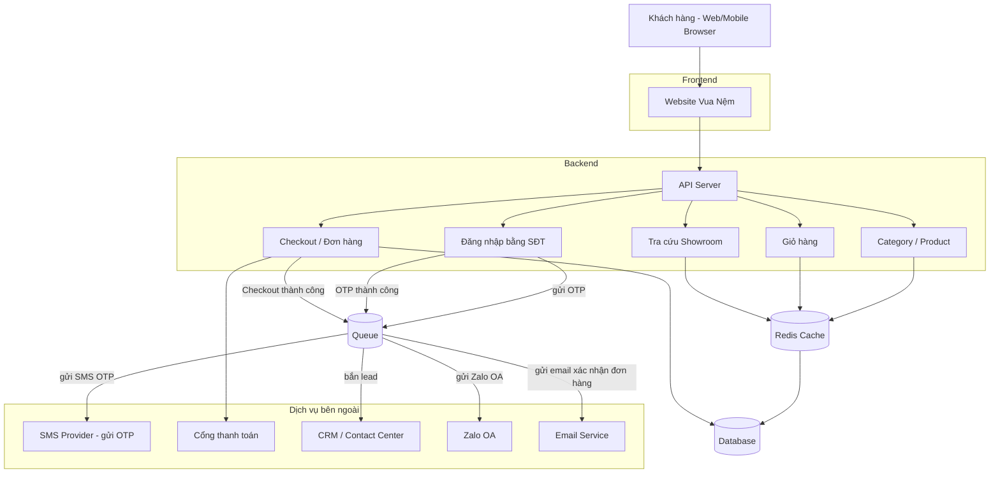

<h1>wayfinder-exercise</h1>

> Người thực hiện: Nguyễn Trường Nguyên 
> Em xin trả lời bài test bằng tiếng Việt

## PART A Reading the code, risk and priorities
### A.1 List every problem you can see in the code above. For each one, add a sentence: if it were left as-is, what would actually go wrong?

1. API GET `/enquiries` và không có bất kỳ phương thức Authentication nào. 

    **Hậu quả:** Đây là API cho Dashboard nhân viên nếu bất kỳ ai biết URL cũng có thể xem toàn bộ tên/email/số điện thoại khách hàng => Lộ dữ liệu cá nhân

2. Cả API POST `/enquiries` không có bất kỳ phương thức validate nào.
    
    **Hậu quả:** Khiến cho bất kỳ ai cũng có thể ghi dữ liệu sai định dạng vào DB thông qua API này

3. API GET `/enquiries` đang list tất cả các record có trong `TourEnquiry`. Nặng hơn là trong `foreach` gọi `$enquiry->tour->name`

    **Hậu quả:** Nếu tương lai data nhiều lên thì sẽ khiến API response chậm và tương lai có thể làm tăng tải cho DB nên cần phải có `limit / page`. Nặng hơn là trong `foreach` gọi `$enquiry->tour->name` gây ra vấn vấn đề **N+1 query** khiến query càng thêm chậm.

4. API POST `/enquiries` nhận và ghi tất cả các fiels trong request

    **Hậu quả:** Vì `$fillable` trong `TourEnquiry` có cả `'status'` và controller dùng `TourEnquiry::create($request->all())` vì thế khách hàng gửi form có thể tự nhét `"status": "booked"` (hoặc bất kỳ giá trị nào) vào request và tự set trạng thái enquiry của chính họ.

5. Cả 2 API đang chỉ xử lý trường hợp success không xử lý trường hợp error hoặc Exception

    **Hậu quả:** Khi `tour_id` không tồn tại (vi phạm FK) hoặc thiếu field bắt buộc, Laravel sẽ ném `QueryException/500 Internal Server Error thô`, có thể lộ SQL, tên bảng, cấu trúc DB nếu `APP_DEBUG=true` gây xấu UX (khách hàng thấy lỗi khó hiểu) vừa là lộ thông tin của hệ thống.

6. Không có rate limiting/throttle trên POST `/enquiries`

    **Hậu quả:** Vì đây là form công khai nên có thể bị spam/bot submit hàng loạt, không có gì chặn. Khiến dữ liệu trong DB sẽ có nhiều data rác và gây highload hệ thống.

### A.2 Assume this is your first day at Wayfinder and you have one day for this module. Pick the three things you would do first, in the order you would do them, and explain why that order.

Nếu đây là ngày đầu tiên của em ở Wayfinder và em có một ngày để làm việc với module này, ba việc đầu tiên em sẽ làm theo thứ tự sau:

1. Việc đầu tiên em sẽ làm là chặn quyền truy cập vào API liệt kê danh sách enquiry, vì đây là trang dashboard nội bộ cho nhân viên Sales nhưng lại đang mở công khai, ai cũng xem được thông tin cá nhân của khách hàng như tên, email, số điện thoại. Đây là rủi ro lớn nhất vì nó đang thực sự lộ dữ liệu khách hàng ngay lúc này, và việc thêm xác thực cho một endpoint nội bộ cũng không mất nhiều thời gian, nên em sẽ ưu tiên làm trước.

2. Việc thứ hai em sẽ làm là sửa lại API nhận form từ khách hàng, thêm validate cho dữ liệu đầu vào và chặn không cho phép khách hàng tự gửi lên trạng thái của enquiry. Đây là lỗi nghiêm trọng vì hiện tại ai gửi form cũng có thể tự đặt trạng thái enquiry của mình thành bất kỳ giá trị nào, ví dụ tự đặt thành đã đặt tour, trong khi thực tế Sales còn chưa liên hệ khách hàng đó. Việc này ảnh hưởng trực tiếp đến quy trình làm việc thật của đội Sales nên em xếp ưu tiên thứ hai, ngay sau vấn đề lộ dữ liệu.

3. Việc thứ ba em sẽ làm là bổ sung xử lý lỗi cho cả hai API, để khi có dữ liệu không hợp lệ hoặc có lỗi hệ thống thì trả về thông báo rõ ràng cho người dùng, thay vì để lộ ra những thông tin kỹ thuật như câu lệnh SQL hay cấu trúc database. Em làm việc này sau cùng vì nó gắn liền với phần validate ở bước hai, làm luôn trong lúc sửa API sẽ hợp lý hơn là tách ra làm riêng.

### A.3 For each item you picked in A.2: do you need any further information from Wayfinder before you can be confident it is the right call? If so, what information? If not, briefly say why not.

1. Với việc đầu tiên là thêm xác thực cho trang dashboard, em cần biết thêm là công ty hiện đã có sẵn hệ thống đăng nhập cho nhân viên nội bộ chưa và ai là người được phép xem trang này, chỉ có Sales hay còn có phòng ban khác. Nếu công ty đã có sẵn cơ chế đăng nhập dùng chung cho các trang quản trị khác thì em sẽ nối vào hệ thống đó thay vì tự làm riêng một cơ chế xác thực mới cho module này, tránh làm rối thêm hệ thống.

2. Với việc thứ hai là sửa API nhận form thì em khá tự tin có thể làm ngay mà không cần hỏi thêm. Vì bốn trạng thái được phép chuyển đã được nêu rõ trong đề bài và việc không cho khách hàng tự đặt trạng thái là một quy tắc nghiệp vụ hợp lý không phụ thuộc vào thông tin nào khác của công ty.

3. Với việc thứ ba là xử lý lỗi em muốn biết công ty có sẵn một chuẩn chung nào cho việc trả lỗi ở các API khác trong hệ thống hay không để làm theo cho thống nhất tránh mỗi API trả lỗi một kiểu khác nhau.

### A.4 Name at least two things you would deliberately not do that day, and explain why.

1. Việc đầu tiên em sẽ không làm trong ngày đầu tiên là sửa lỗi hiệu năng ở API liệt kê enquiry, chỗ đang bị gọi nhiều câu truy vấn thừa khi lấy tên tour. Vấn đề này chỉ thực sự ảnh hưởng khi dữ liệu lớn lên, còn hiện tại chưa gây ảnh hưởng thật đến người dùng, nên em sẽ để lại làm sau khi đã xử lý xong các vấn đề về bảo mật và nghiệp vụ quan trọng hơn.

2. Việc thứ hai em sẽ không làm là viết lại toàn bộ module theo một kiến trúc mới mà em thấy tốt hơn. Em mới vào công ty một ngày, chưa hiểu hết những phần khác của hệ thống có đang phụ thuộc vào cách code hiện tại hay không nên việc sửa nhỏ, đúng trọng tâm sẽ an toàn hơn nhiều so với việc viết lại trên diện rộng khi chưa nắm rõ bối cảnh.

## PART B Implementation and testing

### B.1 The public form: Make the endpoint that receives submissions from the public form accept only data that is valid and safe to store.

Em thêm một Form Request tên `StoreEnquiryRequest` để validate trước khi tạo enquiry, không còn dùng `request->all()` như code cũ. `tour_id`, `name`, `email` là bắt buộc, `tour_id` phải tồn tại trong bảng `tours`, `email` phải đúng định dạng. `phone`, `preferred_month`, `message` để nullable theo đúng migration gốc.

`status` thì em không đưa vào rule validate luôn, nên khách hàng có gửi `status` lên hay không cũng không quan trọng, giá trị đó không bao giờ được dùng tới. Enquiry mới tạo ra luôn có `status` là `new`, gán cứng trong controller.

### B.2 Status update endpoint

Em thêm route `PATCH /api/enquiries/{enquiry}/status`, xử lý trong hàm `updateStatus` của `EnquiryController`. Danh sách trạng thái hợp lệ và các cặp chuyển trạng thái được phép em đưa vào 2 hằng số trong model `TourEnquiry` là `STATUSES` và `ALLOWED_STATUS_TRANSITIONS`, kèm một hàm `canTransitionTo` để kiểm tra.

Gửi `status` sai, không nằm trong 4 giá trị `new`, `contacted`, `booked`, `closed` thì bị chặn ngay ở bước validate. Còn giá trị đúng nhưng chuyển sai thứ tự, ví dụ đang `new` mà nhảy thẳng sang `booked`, thì trả về lỗi `422` kèm message nói rõ không chuyển được từ đâu sang đâu, `status` trong DB giữ nguyên không đổi.

### B.3 Automated tests

Em viết 8 test trong `tests/Feature/EnquiryTest.php`, trong đó chọn 2 hành vi quan trọng nhất để giải thích ở đây.

Cái đầu tiên là khách hàng không thể tự set `status` khi gửi form, dù gửi giá trị gì lên cũng vậy. Đây là lỗi nặng nhất trong code gốc, nên em muốn có test giữ hành vi này lại, để sau này lỡ ai sửa code mà quay về cách cũ thì test sẽ báo lỗi ngay, không phải đợi phát hiện ngoài production.

Cái thứ hai là chuyển trạng thái sai thứ tự phải bị từ chối và `status` trong DB không được đổi. Đây là quy tắc nghiệp vụ chính của cả module, sai chỗ này thì một enquiry có thể nhảy thẳng từ `new` sang `closed`, bỏ qua luôn bước Sales liên hệ khách hàng.

Ngoài 2 cái này em test thêm các case còn lại theo đúng yêu cầu bắt buộc của đề: thiếu field, email sai định dạng, `tour_id` không tồn tại, chuyển trạng thái đúng thì thành công, và list enquiry trả về đúng kèm tên tour.

### Các thay đổi bổ sung và giả định

Em sửa thêm chỗ N+1 query ở API liệt kê enquiry, code cũ lấy tên tour trong vòng `foreach` nên mỗi enquiry tốn thêm một query riêng. Em thêm `with('tour')` là xong, không đổi gì khác về logic hay dữ liệu trả về.

Em cũng phát hiện lúc test bằng Postman, nếu gọi API mà không có header `Accept: application/json` thì Laravel không nhận request đó là gọi API, dẫn đến khi validate lỗi nó redirect về trang chủ và trả ra HTML thay vì JSON. Em sửa bằng cách thêm `shouldRenderJsonWhen` trong `bootstrap/app.php`, ép mọi request vào `api/*` luôn trả JSON dù client có gửi `Accept` header hay không, và có viết thêm 1 test cho hành vi này.

Giả định của em: chưa cần thêm authentication cho API liệt kê hay rate limiting cho API nhận form, vì đề không bắt buộc ở Phần B, với lại Phần A em cũng đã nói sẽ không làm vội hai việc này trong ngày đầu tiên. Và chỉ có đúng 4 trạng thái `new`, `contacted`, `booked`, `closed` như đề bài nêu, không có trạng thái nào khác.

## PART C A production incident

Chào anh/chị,

Em vừa nghe Sales báo lại sáng nay và đang trực tiếp kiểm tra ngay. Em xin phép chưa kết luận nguyên nhân vội, vì em mới vào công ty được hai tuần và chưa đọc hết code của module này.

Việc đầu tiên em làm là tự tay submit thử một form giống khách hàng, xem dữ liệu có lưu vào database không. Song song đó em check thẳng database xem ba ngày qua thực tế có bao nhiêu yêu cầu tư vấn được lưu lại, rồi đối chiếu với những gì Sales đang thấy trên hệ thống của mình.

Nếu database có đủ data mà Sales không thấy, thì lỗi nằm ở phía hệ thống hiển thị cho Sales, không phải ở form. Còn nếu database thiếu hoặc trống, thì đúng là form đang có vấn đề thật. Em cần biết chắc cái này trước khi nói hướng sửa và không muốn đoán mò. Em cũng đang thử liên hệ lại bạn dev cũ dù hiện tại chưa liên hệ được.

Em sẽ gửi update cho anh/chị trước 11 giờ sáng nay, nói rõ nguyên nhân là gì và hướng xử lý. Em sẽ ưu tiên xử lý việc này trước mọi việc khác trong hôm nay.

## PART D Your background and self-review

### D.1 A system you have built

#### 1. What the system does, functionally

Hệ thống website Ecommerce Vua Nệm. Chức năng chính của hệ thống là listing những sản phẩm của công ty trên website, thu sales lead, thanh toán online.

URL: https://vuanem.com

#### 2. Which part you were personally responsible for

Hầu như tất cả các phần trên website này em là người chịu trách nhiệm chính vì website đã từng đập đi xây lại từ đầu. Trong team thời điểm đó có thêm một bạn hỗ trợ thêm phần Frontend còn lại cả Frontend + Backend + System & Technical Lead em đều đảm nhiệm. 

#### 3. The most important technical decision you made

- Quyết định kỹ thuật quan trọng nhất có lẽ là việc tách project monolith hiện tại ra thành một số micro service nhỏ hơn.

- Thêm các giải pháp để xử lý traffic lớn (cache, queue, CDN) cho mỗi mùa Sale

#### 4. The hardest problem you hit once it was running in production

- Downtime lúc traffic tăng đột biến (flash sale, ads đổ vào)
- Bug âm thầm gây mất data hoặc sai lead khách hàng trên những form thu lead của các Landing Page

#### 5. One decision you would make differently if you did it again

Xây dựng đủ test, triển khai đủ monitoring để phát hiện lỗi và có phương án xử lý lỗi sớm nhất

#### Sơ đồ kiến trúc đơn giản

### D.2 Reviewing your own submission

Em tự tin nhất ở Phần B, vì logic nghiệp vụ quan trọng nhất là không cho khách hàng tự set status và chỉ cho phép đúng 4 transition, em đã kiểm tra kỹ bằng test tự động chạy pass hết nên chắc chắn đúng yêu cầu.

Em kém tự tin nhất ở D.1 vì đây là nhớ lại một hệ thống em từng làm cách đây một thời gian và không có tài liệu gốc để đối chiếu lại nên một số chi tiết như luồng cache hay queue em mô tả theo trí nhớ và có thể không khớp 100% với thực tế lúc đó.

Nếu có thêm hai giờ, em sẽ dùng để làm hai việc đã nêu ở A.1 nhưng chưa làm trong Phần B: thêm authentication cho API liệt kê enquiry, và thêm rate limiting cho API nhận form, để giải pháp hoàn thiện hơn chứ không chỉ dừng ở đúng yêu cầu bắt buộc.

### D.3 Your questions

Hiện em đã hết câu hỏi. Mọi thắc mắc đã được giải đáp ở buổi phỏng vấn.